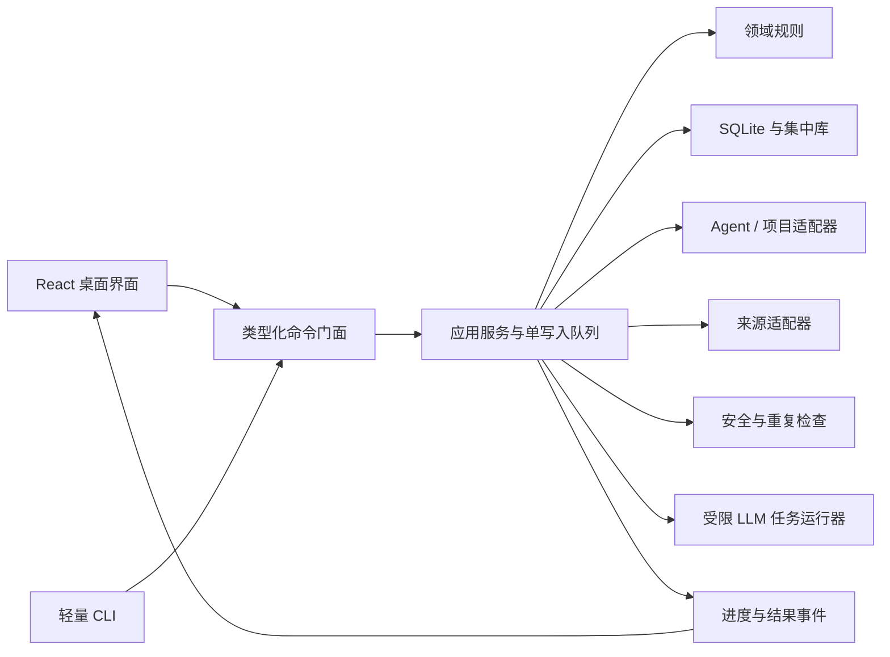

# SkillHub 技术架构设计

> 状态：核心架构已确认，作为后续开发计划与实现的技术基线
>
> 更新日期：2026-08-22
> 上游文档：[需求文档](./需求文档.md)、[产品与交互设计](./产品与交互设计.md)、[Agent 平台兼容性调研](./Agent平台兼容性调研.md)

---

## 1. 文档目的

本文定义 SkillHub 当前完整功能范围的技术实现边界，解决以下问题：

- Windows 与 macOS 桌面应用如何共享同一套本地 Skill 管理核心。
- 集中库、SQLite、Agent 目录、项目目录和版本数据如何分工。
- 导入、部署、解除部署、删除、回滚和恢复如何保证一致性。
- 多 Agent 平台差异如何通过适配器隔离。
- 基础安全检查、LLM 安全检查、语义重复和全文搜索如何协作。
- 普通用户不安装 Git、不理解命令行和软链接时，产品如何仍然可用。
- 应用如何在典型几十至一百多个 Skill 的环境下快速启动并稳定运行。

本文不重新定义功能范围和交互规则；冲突时以需求文档和产品与交互设计为准，并应先更新上游文档再调整本设计。

---

## 2. 架构目标与约束

### 2.1 核心目标

1. 本地优先：无账号、无云端服务和无网络时仍可完成核心管理。
2. 单一事实来源：业务状态由 Rust 核心、SQLite 和集中库共同确定，前端不维护第二套业务真相。
3. 文件安全：任何批量写操作都可解释、可追踪，并尽量可恢复。
4. 普通用户可用：不把 Git、终端、管理员权限或外部 Markdown 软件作为前置条件。
5. 平台可扩展：Agent 目录和能力差异集中在版本化适配器中。
6. 可测试：没有安装全部 Agent 时，仍能通过模拟目录验证文件管理行为。
7. 安全默认：外部 Skill、Markdown、Mermaid、来源输入和 LLM 返回内容均视为不可信数据。

### 2.2 规模边界

- 普通用户通常管理几十个 Skill。
- 开发者通常管理几十至一百多个 Skill。
- 以 300 个 Skill 作为设计和自动化性能测试基准。
- 超过 300 个仍允许使用，但不承诺同等级性能，不设置硬性数量上限。
- 不为企业级海量资产建设分布式存储、搜索集群或远程任务系统。

### 2.3 当前平台边界

- 正式支持 Windows 与 macOS。
- Windows 是首要体验与验证基准。
- Linux 当前不纳入正式支持范围。
- 当前集中库只正式支持操作系统呈现为普通本地文件系统路径的目录。
- NAS、SMB 和云盘专项模式只预留扩展边界，留到下一个大版本重新设计。

---

## 3. 总体架构

SkillHub 采用 Tauri 桌面壳、React 前端、Rust 核心和 SQLite 本地数据库。桌面端与 CLI 共享业务核心，不各自实现一套文件管理规则。

### 3.1 分层职责

| 层 | 职责 | 禁止事项 |
|---|---|---|
| React 前端 | 展示、输入、导航、临时交互状态 | 直接写文件、直接访问 SQLite、执行系统命令 |
| 命令门面 | 类型化参数校验、权限边界、任务启动 | 暴露任意路径写入或任意命令执行接口 |
| 应用服务 | 编排用例、事务、恢复点、操作记录、进度 | 包含具体 Agent 页面逻辑 |
| 领域核心 | 身份、版本、部署、冲突、状态和规则 | 依赖 UI、Tauri 或特定平台路径 |
| 基础设施与适配器 | 文件系统、SQLite、Agent、来源、LLM、系统能力 | 绕过领域规则直接改变业务状态 |

---

## 4. 技术栈

### 4.1 桌面端与前端

- Tauri 2：Windows/macOS 桌面壳、系统能力和安装包。
- React + TypeScript + Vite：桌面界面。
- TanStack Query：核心查询缓存、加载状态和失效刷新。
- TanStack Table：高密度 Skill、项目和 Agent 列表。
- Tailwind CSS + CSS 设计令牌：主题、间距、字体、圆角和层级。
- Radix Primitives：抽屉、弹窗、菜单、提示、焦点与键盘行为。
- Motion for React：动态抽屉、详情切换和局部状态过渡。
- Apache ECharts：首页部署分布柱状图，按需加载并启用可访问描述。
- CodeMirror 6：轻量 Markdown 源码编辑。
- remark/rehype 体系：CommonMark/GFM 解析、渲染和危险内容过滤。
- i18next + react-i18next：前端国际化。

不采用整套通用后台模板。SkillHub 在无样式行为组件之上维护自己的设计令牌和产品组件层，具体颜色留到视觉设计阶段决定。

### 4.2 Rust 核心

- Cargo Workspace 管理核心、基础设施、适配器、桌面端和 CLI。
- Tokio 负责受控异步任务、取消和并发。
- rusqlite 使用内置 SQLite 与 FTS5，避免用户安装数据库服务。
- notify 提供文件系统变化提示；监听事件只作为线索，最终状态仍通过扫描确认。
- reqwest 承担受限 HTTP 获取和 LLM API 调用。
- gix 提供内嵌、只读的 Git 仓库获取与解析能力，不依赖系统 Git。
- SHA-256 用于内容身份、版本对象、校验值和去重。

### 4.3 明确不引入

- Electron。
- 外部数据库或搜索服务。
- 向量模型、Embedding API、向量索引或向量数据库。
- 系统 Git 前置依赖。
- npx、Shell、PowerShell 或任意外部命令执行器。
- 后台常驻服务和托盘常驻监控进程。

---

## 5. 代码组织

Cargo Workspace 保持少量清晰模块，不在开发早期拆成大量微型 crate：

- `skillhub-core`：领域对象、业务规则和应用用例接口。
- `skillhub-storage`：SQLite、集中库、版本对象、备份和迁移。
- `skillhub-adapters`：Agent、项目、来源、基础检查、LLM 和系统能力适配。
- `skillhub-desktop`：Tauri 入口、命令、事件和桌面权限。
- `skillhub-cli`：共享核心的轻量命令行入口。
- `skillhub-testkit`：模拟目录、固定样本、故障注入和跨平台测试工具。

前端按产品功能划分：

- 应用外壳、导航与初始化。
- 技能库与 Skill 详情。
- Agent、目标目录与部署。
- 项目与共享配置。
- 发现、来源与导入。
- 安全检查与语义重复。
- 待处理、任务与恢复。
- 设置、备份、迁移与应用更新。
- 公共组件、设计令牌与类型化核心调用层。

Agent 品牌差异不能散落在页面组件中。

---

## 6. 核心领域模型

### 6.1 Skill 身份与内容

- `SkillId` 是 SkillHub 内部稳定身份，不以名称或目录名作为主键。
- Skill 名称是可修改的业务属性。
- 每个正式保存内容形成不可变 `SkillVersion`。
- 当前版本、来源上游版本、项目固定版本和部署版本分别表达，不能混为一个字段。
- 生命周期只有正常、弃用和归档；“临时试用”是特殊标签与待处理规则，不新增生命周期状态。

### 6.2 平台与目标

Agent 适配使用以下层次：

- 品牌：OpenAI、Anthropic、Google 等。
- 客户端：CLI、桌面端、IDE 扩展、工作台等。
- 实例：同一客户端在本机发现的独立安装或用户配置实例。
- 逻辑目标：某 Agent 全局层级或某项目层级。
- 物理目标：最终承载文件的真实目录。

多个逻辑目标指向同一物理目录时，关系视图合并物理节点，避免重复部署和重复删除。

### 6.3 部署关系

“部署”仅表示把集中库中的 Skill 以受管理方式放入 Agent 或项目的 Skill 目录，使文件处于该平台可发现的位置。它不是远程发布、插件安装或运行时授权。

部署记录至少关联：

- Skill 与具体版本。
- 逻辑目标和物理目标。
- 运行时目录名。
- 部署方式。
- 创建与最后核对时间。
- 当前物理状态、管理状态和异常原因。

SkillHub 不声称 Agent 已加载、已调用、已授权或功能可用。

### 6.4 状态计算

- 数据库保存事实、证据和用户处理决定，不保存可从事实可靠推导的重复状态文本。
- 物理状态与管理状态分开计算。
- 基础安全检查和 LLM 安全检查是两个独立结果，使用统一状态集合但分别展示。
- 待处理事项由试用到期、检查异常、冲突、外部变化、未完成操作和关系异常等事实派生。
- 用户处理某条异常后，检查汇总结果必须随明细联动更新。

---

## 7. 存储架构

### 7.1 混合存储

SkillHub 使用“可见集中库 + 本机数据库”的混合模式：

- 默认集中库：`~/SkillHub/skills`。
- 集中库内部管理区：`~/SkillHub/.skillhub`。
- SQLite、设备配置、缓存和调试日志：操作系统应用数据目录。
- LLM 与私有来源密钥：Windows Credential Manager 或 macOS Keychain。

集中库存放可迁移的 Skill 内容、版本对象和便携管理元数据；SQLite 存放查询索引、任务、设备发现结果、视图配置和运行状态。

### 7.2 同名 Skill

- 集中库物理目录采用稳定、可读且唯一的编码，例如 `name--shortid`。
- 显示名称、内部身份、集中库物理目录名和 Agent 运行时目录名相互独立。
- 同名不同内容可在集中库共存。
- 同一物理目标的同一层级不能同时部署两个运行时同名 Skill。
- 用户确需共存时，必须复制或派生为独立 Skill，并真正修改运行时名称。

### 7.3 版本对象

- 每个版本以规范化清单描述文件路径、大小、内容哈希和必要元数据。
- 文件内容进入按 SHA-256 寻址的对象区，相同内容只保存一次。
- 版本清单不可变，当前版本指针可变。
- 回滚创建新的当前状态和操作记录，不篡改历史版本。
- 版本体系不要求用户理解或安装 Git。

### 7.4 SQLite

- SQLite 是本机查询与操作数据库，不是唯一可恢复副本。
- 使用 WAL 和短事务，避免大文件哈希或网络操作长期占用写锁。
- FTS5 保存可搜索文本，BM25 用于候选相关度排序。
- 数据库表结构版本与集中库元数据格式版本独立演进。

---

## 8. 写操作、事务与并发

### 8.1 单写入模型

- 桌面端和 CLI 共享同一写入协调机制。
- 同一集中库同一时间只允许一个受管理写操作进入关键阶段。
- 只读查询可以并行；哈希、解析和网络获取可在写入前受控并行。
- 操作使用稳定 `OperationId`，防止重复点击和重试造成重复导入或重复部署。

### 8.2 统一写入流程

重要写操作采用：

1. 解析内部 ID 和目标，不直接信任前端路径。
2. 预检路径、同名冲突、所有权、检查结果和磁盘条件。
3. 建立必要恢复点并写入操作意图。
4. 在临时位置准备内容。
5. 执行原子替换或最小范围文件变更。
6. 核对落盘结果。
7. 提交数据库事实和操作结果。
8. 清理临时数据并发送查询失效事件。

部分批量失败时，每个目标保留独立结果；已经成功的目标不能被错误显示为整体失败或整体回滚。

### 8.3 取消与崩溃恢复

- 扫描、获取和 LLM 等可安全取消阶段允许取消。
- 文件替换关键区间不强制中断，完成当前原子步骤后再停止。
- 应用重启时读取未完成操作，核对文件事实后给出继续、回滚或人工处理路径。
- 前端关闭抽屉或切换页面不终止后台任务。

---

## 9. 部署实现

### 9.1 部署方式

按目标能力和用户选择使用：

1. 符号链接：优先方案，集中库修改可直接反映到目标。
2. Windows 目录链接：在不需要管理员权限且目标适合时作为目录级回退。
3. 受管复制：链接不可用或用户选择复制时使用，并明确展示可能产生独立修改。

不要求普通用户开启开发者模式或管理员权限。部署规划器根据平台、目标、卷和权限选择可行方案，并在执行前显示结果。

### 9.2 添加与解除部署

- 添加到 Agent 支持单选和多选。
- “共享给兼容 Agent”仍是从集中库分别部署到各 Agent 自己的目标目录，不依赖 `~/.agents/skills` 作为通用标准。
- 解除部署只删除 SkillHub 创建且已核对所有权的链接或受管副本，保留集中库原件。
- 删除集中库 Skill 前必须检查 Agent、项目和版本依赖，并提供解除部署、保留对象、归档或取消等操作。
- 目标内容已被外部修改时，解除部署前允许收集修改、保留独立副本或取消，不静默删除。

### 9.3 所有权保护

- 写入前核对目标是否由 SkillHub 管理。
- 不覆盖 Agent 内置、插件、自有或未知来源的同名目录。
- 内置和插件 Skill 默认只读，可复制导入为集中库独立对象。
- “强制导入”只允许重复对象进入集中库，不代表强制覆盖 Agent 目标。

---

## 10. Agent 与项目适配器

### 10.1 适配规则

官方适配规则随应用版本内置，至少包含：

- 品牌、客户端类型和能力说明。
- 全局与项目级目录候选。
- 平台路径模板和发现线索。
- 目标是否支持目录型 Skill。
- 推荐部署方式与已知限制。
- 官方文档依据、最后核对日期和规则版本。

适配器不识别 Agent 具体版本，不判断登录、授权、项目信任和 Skill 运行可用性。

### 10.2 更新与覆盖

- 内置规则不从网络静默更新；重要变化随 SkillHub 应用发布并进入变更说明。
- 升级规则发现目录变化时先扫描和提示，不自动搬移或删除旧目录。
- 用户可创建自定义 Agent 和自选 Skill 目录作为永久兜底。
- 内置规则的用户调整形成独立本地覆盖，并可恢复默认。
- 自定义规则只允许路径与声明能力配置，不允许命令、脚本或安装钩子。

### 10.3 项目适配

- 项目是独立管理对象，允许数量多于 Skill 和 Agent。
- 项目可拥有多个标签并进入保存筛选视图，不建立复杂多层目录树。
- 项目共享配置描述期望 Skill、版本约束和来源提示，不上传 Skill 内容。
- “尽力装配”复用统一来源、重复、检查、部署和结果模型；无法满足的条目保留为明确结果。

---

## 11. 扫描、监听与索引

### 11.1 初始化发现

- 初始化只扫描集中库、已知 Agent 目录、已注册项目和用户明确选择的目录。
- 不进行无边界全盘搜索。
- 识别通用 `~/.agents/skills` 目录，但不把它视为所有 Agent 的标准部署目标。
- 原 Skill 位于已识别 Agent 或项目目录时，导入可选择接管、复制或仅建立关系。

### 11.2 混合变化检测

- 首次扫描建立基线。
- 文件监听只提供“某处可能变化”的提示。
- 事件经过合并与稳定等待后，对受影响 Skill 重新扫描。
- 应用恢复前台、执行高风险操作前和用户手动触发时进行补偿扫描。
- 监听丢失、目录离线或事件溢出时，退回局部或完整核对。

### 11.3 全文搜索与重复候选

- Skill 名称、原始描述、译文、用户备注、标签、作者、许可证和 Markdown 正文进入 FTS5。
- 使用适合中英文混合内容的规范化与分词策略。
- BM25 用于本地搜索排序和语义重复候选预筛。
- 确定性哈希、名称、结构和元数据规则优先于 LLM。
- 不引入向量模型或向量数据库。

---

## 12. 导入与来源获取

### 12.1 统一导入管线

所有入口最终进入同一管线：

1. 解析来源或本地路径。
2. 获取到隔离的临时工作区。
3. 识别一个或多个目录型 Skill。
4. 执行格式和基础安全检查。
5. 执行完全重复、同名冲突和候选语义重复检查。
6. 让用户确认复制、接管、关联、跳过或强制保留独立对象。
7. 写入集中库并建立初始版本。
8. 按用户选择部署到一个或多个目标。

### 12.2 来源适配器

- 本地文件夹和 Skill 页面链接先解析为受支持来源描述。
- Git 来源由内嵌 gix 以只读方式获取，不调用系统 Git。
- 可识别的 npx 导入命令只用于解析包名、来源和参数，SkillHub 不执行 npx。
- HTTP 获取使用域名、重定向、大小、超时和内容类型限制。
- 下载或解包过程防止路径穿越、符号链接逃逸和压缩炸弹。
- 获取完成前不执行其中任何代码、脚本、安装器或钩子。

---

## 13. 安全检查与 LLM

### 13.1 基础安全检查

基础检查使用确定性规则，不运行 Skill：

- 危险命令和高风险脚本调用。
- 删除、提权、权限修改、持久化和远程下载执行模式。
- 敏感信息、疑似凭证、私钥和认证头。
- 可疑外联、数据上传、命令拼接、编码混淆和跨目录访问线索。
- Markdown 危险 HTML、外部资源和路径逃逸。

规则结果包含稳定代码、位置、证据、严重程度和处理状态。用户主动写入 API Key 不会自动阻止导入或部署；系统提示明文泄露风险，允许确认继续或忽略该具体项。

### 13.2 LLM 安全检查

LLM 是可选增强能力，弥补规则无法覆盖的语义风险：

- 提示词注入与越权诱导。
- 隐蔽的数据收集、外传或权限扩大意图。
- 多文件组合后才显现的危险流程。
- 伪装成正常说明的执行指令或安全绕过。
- 基础规则证据的语义关联与解释。

基础检查和 LLM 检查分别展示，不把二者合成一个不可解释分数。

### 13.3 受限 LLM 任务运行器

- 直接调用用户配置的模型 API，但封装为固定输入输出的极简任务运行器。
- 不提供工具调用、任意文件访问、自主循环、Agent 记忆或命令执行。
- 每类任务使用固定 schema、大小限制、超时、重试和取消策略。
- LLM 只用于安全增强、语义重复、描述翻译和已确认的联网搜索查询辅助。
- 不提供通用聊天、功能评分、兼容性判断或不确定的通用修改建议。
- 未配置 LLM 时，本地管理、基础安全检查、FTS5 搜索和确定性重复检查正常工作。

### 13.4 语义重复

- 先用完全哈希、名称、结构和 BM25 选出少量候选。
- LLM 比较共同能力、独有能力、包含关系、权限、安全结果、来源和本地修改。
- 可以建议保留 A、保留 B、保留两者或归档其中一个，并给出依据。
- 建议不自动执行，最终由用户决定。

---

## 14. Markdown 预览与编辑

- 内置阅读视图、源码视图和轻量编辑，不依赖系统 Markdown 应用。
- 支持 CommonMark、GFM、YAML Frontmatter、表格、任务列表、脚注、代码块、本地图片和相对链接。
- 代码块只高亮和复制，绝不执行。
- Mermaid 使用严格安全模式；失败退回普通代码块。
- 过滤危险 HTML 和属性；相对资源限制在当前 Skill 内。
- 远程图片默认阻止，外部链接展示真实目标并确认后交给系统浏览器。
- 未识别 Markdown 扩展保留原文，保存时不由渲染器改写。
- 编辑先写本机草稿，显式保存后形成新版本并触发格式、引用和安全检查。
- 只读或未接管内容只能预览，可通过复制导入或接管后编辑。
- 复杂脚本、多文件和非 Markdown 编辑继续交给外部编辑器。

---

## 15. 前端状态与界面基础设施

### 15.1 状态管理

- Rust 核心与 SQLite 是业务事实来源。
- TanStack Query 管理查询缓存和重新读取。
- React 本地状态管理筛选输入、抽屉开关和表格临时选择。
- 轻量全局状态只承载当前工作区、抽屉宽度和跨页面临时选择。
- 列设置、抽屉模块、保存筛选视图和语言写入本机设置数据库。
- 部署、删除、迁移和回滚等待核心确认；标签、备注等轻量操作可谨慎使用乐观更新。

### 15.2 动态界面

- 抽屉支持标准、加宽、近全屏和拖动调整，尺寸可记忆。
- Motion 只用于有信息意义的位移、透明度和局部布局过渡。
- 系统启用减少动态效果时，禁用或弱化变换动画。
- 关闭抽屉后恢复原列表筛选、滚动、选择和键盘焦点。
- 首页柱状图支持点击下钻，同时提供文字摘要、数值标签和可访问描述，不能只靠颜色传达状态。

---

## 16. 启动与性能

### 16.1 启动生命周期

1. 尽快显示应用外壳，不使用长时间品牌启动页。
2. 打开 SQLite，展示上次已知的首页、列表和待处理数据。
3. 检查未完成操作和必要数据库迁移。
4. 后台核对集中库、Agent 与项目目录。
5. 基线核对完成后启动文件监听。
6. 本地界面可用后，再运行应用更新、来源和 LLM 等非必要网络任务。

### 16.2 性能策略

- 在约 100 个 Skill、无迁移的常见环境中，目标为 2 秒内进入可交互缓存首页。
- 首页可用不等待全量扫描完成。
- 首次扫描读取完整目录；后续优先比较路径、时间、大小和已有指纹，只重新哈希变化内容。
- FTS5 按变化 Skill 增量更新。
- Markdown、Mermaid、编辑器、差异查看和 ECharts 按需加载。
- 扫描、哈希、备份、下载和检查使用有上限的后台并发。
- LLM 使用独立限流队列，不阻塞本地操作。
- 以 300 个 Skill 覆盖全量扫描、搜索、备份、恢复和批量部署基准。
- 单个目录离线或 Skill 解析失败不能导致整个应用无法启动。

---

## 17. 国际化

- 首发内置简体中文和英文，首次启动跟随系统语言并允许即时切换。
- 前端翻译按产品模块拆分命名空间，并进行 TypeScript 键约束。
- Rust 核心返回稳定错误代码、参数、严重程度和可执行操作，不返回拼好的中文业务错误。
- CLI 使用相同错误代码；`--json` 只输出稳定代码和结构化数据。
- 数据库保存枚举和原始值，不保存“已部署”等界面翻译文本。
- 日期、时间、数字、文件大小和复数按当前语言格式化。
- Skill 名称、路径、作者、许可证、原始描述和证据保持原文。
- Skill 描述 LLM 译文独立保存并标明目标语言、模型生成或用户修订，不属于界面 i18n。
- Agent、模型和产品官方品牌名称保持原名。

---

## 18. 配置、密钥与隐私

### 18.1 配置分类

- 普通设置：语言、主题、视图、频率和升级策略，保存于本机 SQLite。
- 便携管理信息：Skill 身份、标签、备注、来源、版本清单和项目共享配置，保存于集中库管理区。
- 设备专属信息：绝对路径、发现客户端、窗口、任务缓存和日志，只保存在当前设备。

### 18.2 密钥

- Windows 使用 Credential Manager，macOS 使用 Keychain。
- SQLite 只保存凭证引用和非敏感配置。
- 系统安全存储不可用时，不降级为明文文件；只允许会话临时使用或稍后配置。
- 连接测试不回显完整请求头和密钥。
- 备份、导出、日志和截图信息不包含密钥。
- 新设备恢复后提示重新配置密钥。

### 18.3 隐私

- 默认不上传 Skill、项目、路径、操作历史、使用证据或诊断数据。
- 不内置遥测和崩溃自动上传。
- 所有网络功能可总开关停用；本地管理仍可使用。
- LLM 调用前展示发送数据范围，并对已知凭证模式进行脱敏。

---

## 19. 备份、恢复与迁移

### 19.1 备份

- 完整备份包含集中库内容、版本对象、便携元数据和恢复所需数据库导出。
- 不把运行中的原始 SQLite 文件作为唯一恢复格式。
- 重要写操作创建轻量恢复点；自动滚动备份按数量或期限保留。
- 备份包包含格式版本、文件清单和校验值，不包含系统安全存储中的密钥。

### 19.2 跨设备迁移

- 标准备份支持 Windows 与 macOS 之间迁移。
- 不迁移设备绝对路径、发现客户端和系统凭证。
- 恢复后重新发现 Agent、项目路径和部署目标，再由用户确认重建部署关系。
- 路径分隔符、大小写和非法字符在导入阶段规范化并报告冲突。

### 19.3 数据库升级

- SQLite 使用内置、按顺序执行的版本迁移。
- 升级前建立数据库恢复点，迁移与校验成功后才切换。
- 迁移失败时恢复旧数据并允许继续使用旧版本。
- 旧版应用遇到新版数据库时禁止写入，避免降级破坏数据。
- 破坏性格式转换前生成完整备份并明确提示。
- 集中库格式与数据库表结构独立版本化。

---

## 20. 日志、操作历史与使用证据

- 操作历史记录用户可理解的导入、部署、删除、回滚和恢复行为。
- 待处理事项是需要用户行动的业务集合，不等同于调试日志。
- 调试日志使用滚动本地文件，记录事件代码、操作 ID、阶段、耗时和脱敏错误。
- 日志不记录 Skill 正文、密钥、完整认证头或不必要的绝对路径。
- 不提供诊断报告导出，不自动上传崩溃和遥测。
- 使用证据分析标记为实验功能，仅供参考；只使用可获得的本地证据并说明数据来源。
- 多 Agent Runtime Hook 是独立关联项目且标记研发中，不作为 SkillHub 核心功能的前置依赖。

---

## 21. 测试架构

### 21.1 核心自动化测试

`skillhub-testkit` 在临时目录中构造集中库、Agent 全局目录和项目目录，覆盖：

- 初始化扫描、身份识别和同名 Skill。
- 导入、复制、接管、来源关联和冲突处理。
- 单选、多选部署、链接回退和受管复制。
- 解除部署、依赖删除、安全脱离和所有权保护。
- 外部修改、版本、回滚、备份、恢复和中断操作。
- 基础安全检查、敏感信息和 Markdown 安全。
- Windows/macOS 路径、大小写和非法字符差异。

### 21.2 前端与契约测试

- 前端组件测试覆盖初始化、批量操作、抽屉、冲突选择、危险确认和错误恢复。
- 命令契约测试保证 TypeScript 输入输出与 Rust 命令 schema 一致。
- 每个 Agent 适配器必须有目录样本和契约测试。
- 旧数据库样本必须覆盖逐版本迁移测试。

### 21.3 真机发布测试

- Windows 与 macOS 真机验证是正式发布门槛。
- 已安装的 Agent 执行实际目录部署和发现测试。
- 未安装 Agent 先依据官方文档和模拟目录验证，不宣称真实运行已验证。
- Windows 重点验证链接、权限、NSIS 与系统安全提示。
- macOS 重点验证权限、路径、DMG、Gatekeeper 和签名状态。
- Agent 真机运行验证在开发完成后按兼容性调研文档分批补充。

---

## 22. 构建、供应链与分发

### 22.1 供应链

- Rust 和前端使用锁定依赖，发布构建不得漂移版本。
- 新依赖评估用途、许可证、维护状态、网络、脚本和系统权限。
- CI 检查已知漏洞、许可证冲突和废弃依赖；高危问题阻止正式发布。
- 前端安装禁止不必要生命周期脚本，例外进入明确白名单。
- Tauri 使用最小权限和严格内容安全策略，不加载远程 JavaScript。
- 正式发布包含依赖清单或 SBOM、Git 提交标识和 SHA-256。
- GitHub Actions 固定关键工作流依赖，Windows/macOS 产物关联同一提交。

### 22.2 Windows 早期分发

- GitHub Actions 构建 Tauri NSIS `.exe` 并通过 GitHub Releases 分发。
- 默认按当前用户安装，不把管理员权限作为前提。
- 未签名阶段明确显示发布者未签名、SHA-256、公开构建流程和 SmartScreen 正常处理说明。
- 不引导用户关闭系统安全能力，不承诺绕过 Smart App Control。
- 未获得可信发布者签名前，应用只提示新版本并打开 GitHub Release 手动更新。
- 首个公开版本后优先申请 SignPath Foundation 开源项目免费签名；是否通过不阻塞早期发布。
- Microsoft Store 是后续可选渠道；必要时再评估商业代码签名。

### 22.3 macOS 早期分发

- GitHub Actions 构建 ad-hoc 签名的 Universal DMG 并通过 GitHub Releases 分发。
- 发布页明确标注未经过 Apple 公证，提供官方继续打开说明、SHA-256 和公开构建流程。
- 不引导关闭 Gatekeeper 或执行不透明绕过脚本。
- 早期只提示新版本并打开 GitHub Release 手动更新。
- 面向普通用户正式发行时，再购买 Apple Developer Program 并切换到 Developer ID 签名、公证和签名更新包。

---

## 23. 当前版本的扩展边界

### 23.1 网络存储

- 存储层保留后端抽象，但当前只实现普通本地路径。
- 设置中只预留“下一大版本规划”说明入口。
- 当前不实现 NAS/SMB 专项能力、云盘识别、网络锁、离线缓存和冲突合并。
- 用户选择同步客户端映射的本地目录时，当前只把它当普通路径，不宣称支持对应服务。

### 23.2 Runtime Hook

- 使用证据输入保留可插拔证据提供者接口。
- 当前只读取可获得、经过用户授权的本地证据。
- 未来 Hook 项目可以提高调用统计准确度，但不能改变 SkillHub 的文件管理事实。

### 23.3 Agent 适配

- 内置适配器使用统一 profile schema。
- 特殊平台能力通过有限扩展接口实现，不允许插件获得任意核心写权限。
- 当前不建设第三方 Agent 适配插件市场。

---

## 24. 关键验收标准

1. 无 Git、无管理员权限和无外部 Markdown 应用的普通用户可以完成核心闭环。
2. 无网络和无 LLM 时，扫描、搜索、导入、版本、部署、基础检查、备份与恢复可用。
3. 约 100 个 Skill 的常见环境中，2 秒内进入可交互缓存首页；后台核对不阻塞使用。
4. 300 个 Skill 覆盖扫描、搜索、批量部署、备份和恢复性能基准。
5. 重复点击、进程中断和部分批量失败不会产生无法解释的重复对象或半部署关系。
6. 删除或解除部署不会静默删除未知、内置、插件或已被外部修改的内容。
7. 基础检查和 LLM 检查各自独立、证据可见，并随用户处理结果联动更新。
8. Markdown、Mermaid、来源内容和 LLM 返回内容不能在应用中执行代码。
9. Windows/macOS 之间可通过标准备份迁移 Skill 与便携元数据，设备路径和密钥重新配置。
10. 桌面端和 CLI 对同一操作使用同一核心规则与结果代码。

---

## 25. 实现计划阶段仍需落定的参数

以下属于实现参数，不改变已确认的产品范围，可在开发计划和技术验证中确定：

- 具体数据库表、索引、迁移编号和集中库元数据文件拆分。
- 文件监听合并窗口、后台并发数、网络超时和重试次数。
- Windows 各部署方式的检测顺序和文件系统能力探测细节。
- 300 个 Skill 性能基准所使用的参考硬件与样本大小分布。
- 各基础安全规则的具体表达式、严重程度和误报基线。
- 支持的 LLM 提供商首批清单与统一请求 schema。
- CI、SBOM、依赖审计和安装包工作流的具体工具选择。
- 真机测试批次、已安装 Agent 样本和发布阻断等级。

这些参数应通过小型技术验证、自动化测试和实现计划确定，不需要重新扩大功能范围。

---

## 26. 参考资料

- [Tauri 2 文档](https://v2.tauri.app/)
- [Tauri Windows Installer](https://v2.tauri.app/distribute/windows-installer/)
- [Radix Primitives Accessibility](https://www.radix-ui.com/primitives/docs/overview/accessibility)
- [Tailwind CSS Theme Variables](https://tailwindcss.com/docs/theme)
- [Motion Reduced Motion](https://motion.dev/docs/react-use-reduced-motion)
- [Apache ECharts Accessibility](https://echarts.apache.org/handbook/en/best-practices/aria/)
- [react-i18next](https://react.i18next.com/getting-started)
- [SignPath Foundation](https://signpath.org/)
- [Microsoft Smart App Control](https://support.microsoft.com/en-us/windows/security/threat-malware-protection/smart-app-control-frequently-asked-questions)
